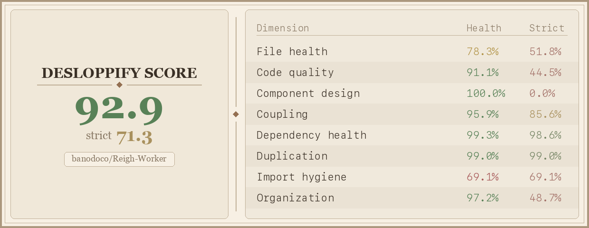

# Reigh-Worker

GPU worker for [Reigh](https://github.com/banodoco/Reigh) — processes video generation tasks using [Wan2GP](https://github.com/deepbeepmeep/Wan2GP).

## Quick Start

```bash
# 1. Create venv
python3 -m venv venv && source venv/bin/activate

# 2. Install dependencies
pip install -r Wan2GP/requirements.txt
pip install -r requirements.txt

# 3. Run worker
SUPABASE_SERVICE_ROLE_KEY="your-key" python worker.py \
    --supabase-url "https://your-project.supabase.co" \
    --worker "my-worker-001"
```

Get credentials from [reigh.art](https://reigh.art/).

## Standalone Usage

Use the generation engine without Reigh for local testing or custom pipelines:

```bash
# Join two video clips with AI-generated transition
python examples/join_clips_example.py \
    --clip1 scene1.mp4 --clip2 scene2.mp4 \
    --output transition.mp4 --prompt "smooth camera glide"

# Regenerate corrupted frames
python examples/inpaint_frames_example.py \
    --video my_video.mp4 --start-frame 45 --end-frame 61 \
    --output fixed.mp4 --prompt "smooth motion"
```

### Using HeadlessTaskQueue Directly

```python
from headless_model_management import HeadlessTaskQueue, GenerationTask
from pathlib import Path

queue = HeadlessTaskQueue(wan_dir=str(Path(__file__).parent / "Wan2GP"), max_workers=1)
queue.start()

task = GenerationTask(
    id="my_task",
    model="wan_2_2_vace_lightning_baseline_2_2_2",
    prompt="a cat walking through a garden",
    parameters={"video_length": 81, "resolution": "896x512", "seed": 42}
)

queue.submit_task(task)
result = queue.wait_for_completion(task.id, timeout=600)
print(f"Output: {result.get('output_path')}" if result.get("success") else f"Error: {result.get('error')}")

queue.stop()
```

## Debugging

```bash
python -m debug task <task_id>          # Investigate a task
python -m debug tasks --status Failed   # List recent failures
```

## Code Health



## Project Structure

See [STRUCTURE.md](STRUCTURE.md) for detailed project layout.

## LTX-2 Integration Status

LTX-2 19B has been integrated into the worker alongside the existing Wan 2.2 pipeline. Below is the current status of each integration phase.

### Phase 1 — LTX-2 + Upstream Wan2GP Updates ✅ Complete

| Component | Status | Location |
|-----------|--------|----------|
| LTX-2 model detection (`_is_ltx2()`) | ✅ | `headless_wgp.py:774` |
| LTX-2 generation path | ✅ | `headless_wgp.py:999-1700` |
| Model loading (`ltx2_19B`) | ✅ | WGP generate_video pattern |
| Worker task routing (`ltx2` task type) | ✅ | `source/task_types.py:90` → `ltx2_19B` |
| HeadlessTaskQueue routing | ✅ | `source/task_registry.py` |
| Upstream WGP v10.83 synced | ✅ | Handler, defaults, configs present |
| Headless `app` reference fix | ✅ | `Wan2GP/wgp.py:8048` |
| GPU test passed | ✅ | 168s generation, video output verified |

### Phase 1b — Testing & Validation ⚠️ Partial

| Test | Status | Notes |
|------|--------|-------|
| LTX-2 GPU generation test | ✅ | `test_ltx2_gpu.py` — 512x320, 17 frames, seed 42 |
| LTX-2 headless smoke tests (26 cases) | ✅ | `tests/test_ltx2_headless.py` |
| Image-anchored test (start/end image) | ✅ | Covered in smoke tests |
| **Wan 2.2 baseline generation test** | ❌ Missing | No test to verify existing Wan behavior is unchanged |
| **HeadlessTaskQueue integration test** | ❌ Missing | Tests call orchestrator directly; production path (queue → conversion → orchestrator) is untested |

### Phase 2 — Image Anchoring + Audio-Driven Video ✅ Complete

| Feature | Status | Location |
|---------|--------|----------|
| `start_image` → `image_start` (PIL) bridging | ✅ | `headless_wgp.py:1113` |
| `end_image` → `image_end` (PIL) bridging | ✅ | `headless_wgp.py:1124` |
| `audio_input` → `audio_guide` bridging | ✅ | `headless_wgp.py:1135` |
| `image_prompt_type` auto-detect (T/TS/TE/TSE) | ✅ | `headless_wgp.py:1140-1153` |
| Audio encoding/conditioning in LTX-2 | ✅ | `Wan2GP/models/ltx2/ltx2.py:844-880` |
| Travel segment image/audio passthrough | ✅ | `source/task_handlers/travel_between_images.py:2024-2058` |

### Phase 3 — Wan vs LTX-2 Toggle ✅ Complete

| Feature | Status | Location |
|---------|--------|----------|
| `use_ltx2` flag in orchestrator payload | ✅ | `source/task_handlers/travel_between_images.py:1670` |
| Model selection (`ltx2_19B` vs Wan) | ✅ | `source/task_handlers/travel_between_images.py:1864` |
| Segment dependency chain (LTX-2 sequential) | ✅ | Lines 1678-1697 |
| Stitch task creation for LTX-2 | ✅ | Lines 368-372 |
| Task type → model mapping | ✅ | `source/task_types.py:71-106` |
| Worker dispatch routing | ✅ | `source/task_registry.py` |

### Remaining Gaps

1. **Wan 2.2 baseline test** — No test exists to confirm existing Wan generation behavior is unchanged after integration.
2. **HeadlessTaskQueue integration test** — The production path (queue → task conversion → orchestrator) has no end-to-end test coverage.

## Powered By

[Wan2GP](https://github.com/deepbeepmeep/Wan2GP) by [deepbeepmeep](https://github.com/deepbeepmeep) — the `Wan2GP/` directory contains the upstream engine.
